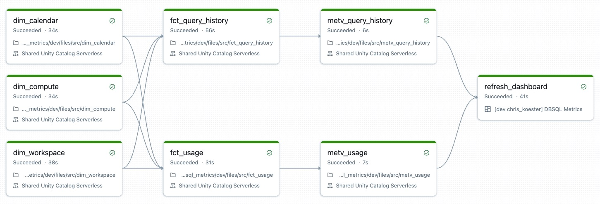

# DBSQL Metrics - Metric Views Example

The DBSQL Metrics project demonstrates how to use [**Databricks Asset Bundles**](https://docs.databricks.com/aws/en/dev-tools/bundles/) with [**Unity Catalog Metric Views**](https://docs.databricks.com/aws/en/metric-views/) to create an end-to-end analytics solution on Databricks. This project deploys a simple dimensional model sourced from [System Tables](https://docs.databricks.com/aws/en/admin/system-tables/), Metric Views, and an AI/BI dashboard, all packaged neatly in a bundle.

This project also shows how to parameterize AI/BI dashboard datasets with DABs, which is not natively supported. Follow [issue 1915](https://github.com/databricks/cli/issues/1915) for updates.



## Prerequisites

### 1. Install the Databricks CLI
Install the Databricks CLI from https://docs.databricks.com/dev-tools/cli/install.html

### 2. Authenticate to your Databricks workspace
Choose one of the following authentication methods:

#### Option A: Personal Access Token (PAT)

1. **Generate Personal Access Token:**
   - Log into your Databricks workspace
   - Click on your username in the top-right corner
   - Select **User Settings** → **Developer** → **Access tokens**
   - Click **Generate new token**
   - Give it a name (e.g., "Local Development") and set expiration
   - Copy the generated token

2. **Configure CLI with PAT:**
   ```bash
   databricks configure --token --profile DEFAULT
   ```
   
   You'll be prompted for:
   - **Databricks Host**: `https://your-workspace.cloud.databricks.com`
   - **Token**: Paste your generated token

    This will update DEFAULT profile in `~/.databrickscfg` 

#### Option B: OAuth Authentication

Configure OAuth:

```bash
databricks auth login --host https://your-workspace.cloud.databricks.com --profile PROD
```

This will:
- Open your browser for authentication
- Create a profile in `~/.databrickscfg`
- Store OAuth credentials securely

#### Verify Configuration

Check your configuration:

```bash
# List all profiles
cat ~/.databrickscfg
```

Your `~/.databrickscfg` should look like:

```ini
[DEFAULT]
host = https://your-workspace.cloud.databricks.com
token = dapi123abc...

[DEV]
host = https://dev-workspace.cloud.databricks.com
token = dapi456def...

[PROD]
host = https://prod-workspace.cloud.databricks.com
token = databricks-cli
```

### 3. Set up Python Virtual Environment
Create and activate a Python virtual environment to manage dependencies:

```bash
# Create virtual environment
$ python -m venv venv

# Activate virtual environment
# On macOS/Linux:
$ source venv/bin/activate
# On Windows:
$ venv\Scripts\activate

# Install required Python packages (n/a currently)
# $ pip install -r requirements-dev.txt
```

### 4. Configure databricks.yml Variables
Update the variables in `databricks.yml` to match your environment. The dev target defaults to catalog `users` and a schema based on on the developer's name.

- **catalog**: The catalog name where your tables will be created
- **schema**: The schema name within the catalog
- **warehouse_id**: ID of your SQL warehouse for production deployment. For development, the bundle will lookup the ID based on the specified name (Eg, Shared Serverless).
- **workspace.host**: Your Databricks workspace URL

Example configuration for prod target:
```yaml
targets:
  prod:
    mode: development
    default: true
    workspace:
      host: https://your-workspace.cloud.databricks.com
    variables:
      warehouse_id: your_warehouse_id
      catalog: your_catalog
      schema: your_schema
```

### 5. Update Dashboard Configuration
Before deploying the bundle, in the base folder, run the Python script to update the dashboard query parameters for the target environment. The target name and CLI profile are required arguments:

```bash
$ python src/replace_dashboard_vars.py --target dev --profile DEFAULT

# OR for PROD

$ python src/replace_dashboard_vars.py --target prod --profile PROD
```

This script:
- Resolves DAB variables for the specified target
- Updates the existing dashboard file (`dbsql_metrics.lvdash.json`)
- Replaces the catalog and schema parameter values
- Preserves all other dashboard configuration settings

## Deployment

### Deploy to Development Environment
```bash
$ databricks bundle deploy --target dev --profile DEFAULT
```
Note: Since "dev" is specified as the default target in databricks.yml, you can omit the `--target dev` parameter. Similarly, `--profile DEFAULT` can be omitted if you only have one profile configured for your workspace.

This deploys everything that's defined for this project, including:
- A job called `[dev yourname] dbsql_metrics_job`
- SQL metric views and dashboards
- All associated resources

You can find the deployed job by opening your workspace and clicking on **Workflows**.

### Deploy to Production Environment
```bash
$ databricks bundle deploy --target prod --profile PROD
```

### Run a Job
```bash
$ databricks bundle run --target prod --profile PROD
```

## Development Tools

For enhanced development experience, consider installing:
- Databricks extension for Visual Studio Code: https://docs.databricks.com/dev-tools/vscode-ext.html

## Documentation

For comprehensive documentation on:
- **Databricks Asset Bundles**: https://docs.databricks.com/dev-tools/bundles/index.html
- **CI/CD configuration**: https://docs.databricks.com/dev-tools/bundles/index.html

## Project Structure

- `assets/`: Images for README
- `resources/`: Bundle resource definitions (Jobs, dashboard)
- `src/`: Source files including notebooks and dashboard
- `src/replace_dashboard_vars.py`: Script to update dashboard configuration with catalog and schema values
- `databricks.yml`: Main bundle configuration file
